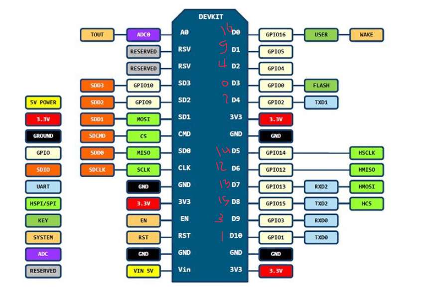

# nodemcuWith7_Segmant

## GPIO & 7-Segmant init

- [1. Python Tutorial](https://www.w3schools.com/python/default.asp)

- [2. 30+ MicroPython Projects, Tutorials and Guides with ESP32 / ESP8266](https://randomnerdtutorials.com/projects-esp32-esp8266-micropython/)

- [3. Install uPyCraft IDE – Windows PC Instructions](https://randomnerdtutorials.com/install-upycraft-ide-windows-pc-instructions/)

- [4. Flash/Upload MicroPython Firmware to ESP32 and ESP8266](https://randomnerdtutorials.com/flash-upload-micropython-firmware-esp32-esp8266/)

- [5. Getting Started with MicroPython on ESP32 and ESP8266](https://randomnerdtutorials.com/getting-started-micropython-esp32-esp8266/)

- [6. Interacting with GPIOs](https://randomnerdtutorials.com/micropython-gpios-esp32-esp8266/)

- [7. How 7 Segment Displays work](https://randomnerdtutorials.com/circuits-7-segment-displays/)

- [8. class Pin – control I/O pins](http://docs.micropython.org/en/latest/library/machine.Pin.html)

- [9. MicroPython tutorial for ESP8266](https://docs.micropython.org/en/latest/esp8266/tutorial/index.html) *important tutorial*

## Acess point set up
  - [1. MicroPython: ESP32/ESP8266 Access Point (AP)](https://randomnerdtutorials.com/micropython-esp32-esp8266-access-point-ap/)

  - [2. ESP32/ESP8266 MicroPython Web Server – Control Outputs](https://randomnerdtutorials.com/esp32-esp8266-micropython-web-server/)

## MIT App Invertor
  - [1. How to Use MIT App Invertor](https://www.youtube.com/watch?v=qWKcOnoyBzE) 
  - [2. ESP8266 Controlled with Android App (MIT App Inventor)](https://randomnerdtutorials.com/esp8266-controlled-with-android-app-mit-app-inventor/) *using .lua*
  - [3. Build an ESP8266 Web Server – Code and Schematics (NodeMCU)](https://randomnerdtutorials.com/esp8266-web-server/) *using .lua*

## ESP8266 Pinouts maping:
```python
D0  = 16
D1  = 5
D2  = 4
D3  = 0
D4  = 2
D5  = 14
D6  = 12
D7  = 13
D8  = 15
D9  = 3
D10 = 1
A0 = 0
```


### *Note*
- Built in Led On Pin D4 So I think it limit in current and the LED is *active LOW*

- PIN D0 is only input without PULL

- you can use Left side pin only as GPIO pins 

- you have only pin A0 as Anlong pin
