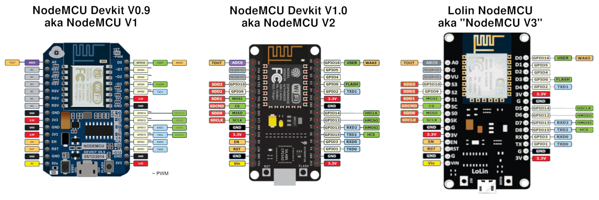
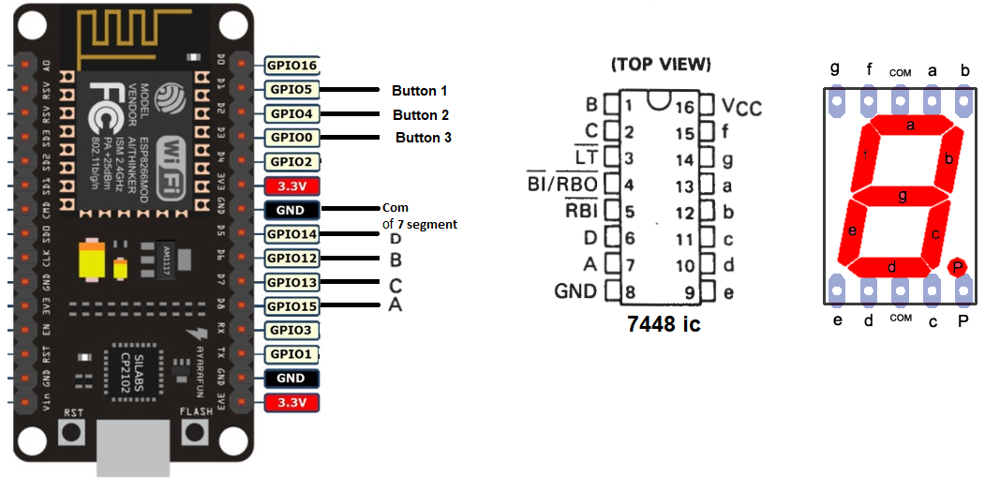
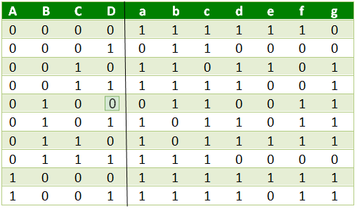
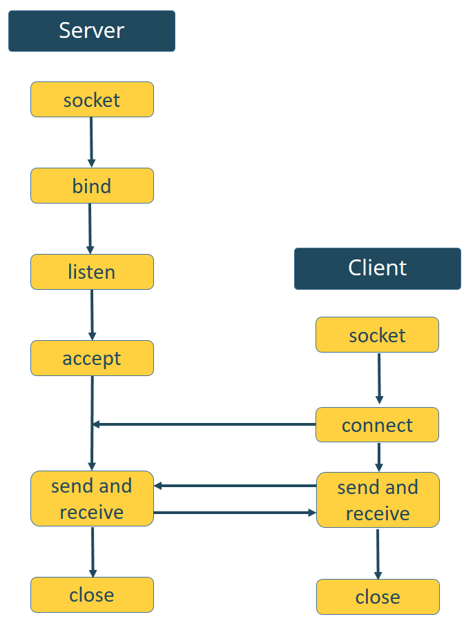
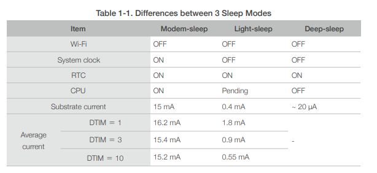
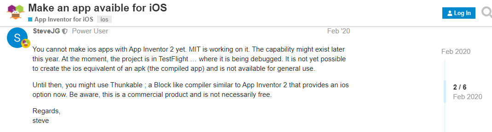
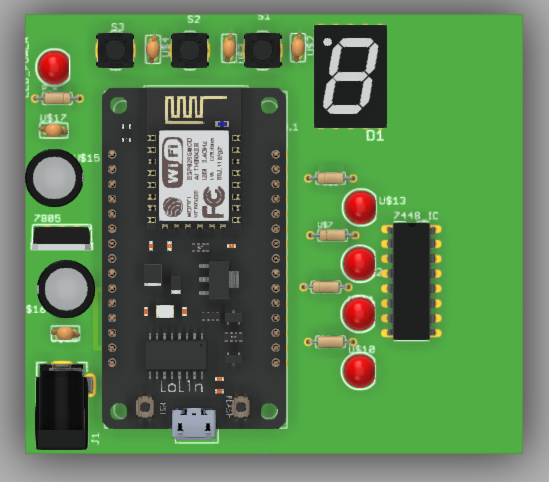
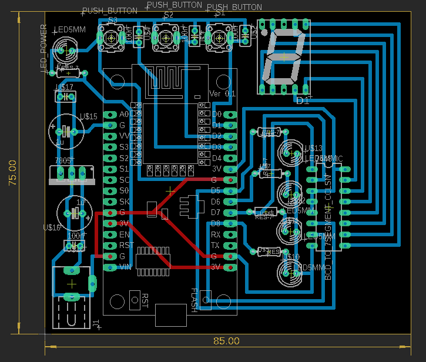

# nodemcuWith7_Segmant

## 1. Useful Tutorial
  - [1. Python Tutorial](https://www.w3schools.com/python/default.asp)
  - [2. 30+ MicroPython Projects, Tutorials and Guides with ESP32 / ESP8266](https://randomnerdtutorials.com/projects-esp32-esp8266-micropython/)
  - [3. MicroPython Basics](https://learn.adafruit.com/micropython-basics-what-is-micropython/overview)
  - [4. MicroPython tutorial for ESP8266](https://docs.micropython.org/en/latest/esp8266/tutorial/index.html) *important tutorial*
  - [5. Easy Coding ESP8266 Tutorial *playlist*](https://www.youtube.com/playlist?list=PLfPtpZzK2Z_Qy2ZbbzvWa58cKKOisMUZ1)
  - [6. MicroPython libraries](https://docs.micropython.org/en/latest/library/index.html)

## 2. Getting Started
 - [ 1. Getting started with MicroPython on the ESP8266 *offical site*](https://docs.micropython.org/en/latest/esp8266/tutorial/intro.html#getting-the-firmware)
 - [2. Install uPyCraft IDE : Windows PC Instructions](https://randomnerdtutorials.com/install-upycraft-ide-windows-pc-instructions/)
 - [3. Flash/Upload MicroPython Firmware to ESP32 and ESP8266](https://randomnerdtutorials.com/flash-upload-micropython-firmware-esp32-esp8266/)
 - [4. Getting Started with MicroPython on ESP32 and ESP8266](https://randomnerdtutorials.com/getting-started-micropython-esp32-esp8266/)
 - [5. MicroPython Basics: Load Files & Run Code](https://learn.adafruit.com/micropython-basics-load-files-and-run-code/overview)
  ### How to Load MicroPython on a Board
   - [Serial REPL](https://learn.adafruit.com/micropython-basics-how-to-load-micropython-on-a-board/serial-terminal?view=all#serial-terminal)
   - [ WebREPL](https://learn.adafruit.com/micropython-basics-esp8266-webrepl)
      - [programming page](http://micropython.org/webrepl/)
      - [rebo of webrebl to download page html for use offline](https://github.com/micropython/webrepl)
      - [File Handling using python](https://www.w3schools.com/python/python_file_handling.asp)
      - [Get a list of files with Python 3 (useing listdir in os module you get the files and the folders in the current dir)](https://stackoverflow.com/questions/3207219/how-do-i-list-all-files-of-a-directory)
        ```python
        import os
        arr = os.listdir()
        print(arr)
        ```


## GPIO & 7-Segmant init
- [1. Interacting with GPIOs](https://randomnerdtutorials.com/micropython-gpios-esp32-esp8266/)
- [2. MicroPython: Interrupts with ESP32 and ESP8266](https://randomnerdtutorials.com/micropython-interrupts-esp32-esp8266/)
- [3. Debouncing in interrupt with nodemcu Micropython Steps](https://forum.micropython.org/viewtopic.php?t=1938)
- [4. Delay and timing](https://docs.micropython.org/en/latest/esp8266/quickref.html#delay-and-timing)
- [5. How 7 Segment Displays work](https://randomnerdtutorials.com/circuits-7-segment-displays/)
- [6. Python OOP  - Python Classes and Objects](https://www.w3schools.com/python/python_classes.asp)
- [7. MicroPython Basics: Loading Modules](https://www.digikey.com/en/maker/projects/micropython-basics-loading-modules/9560902ac9654f7e91f098e723d097ad)

## Acess point set up
  - [1. MicroPython: ESP32/ESP8266 Access Point (AP)](https://randomnerdtutorials.com/micropython-esp32-esp8266-access-point-ap/)
  - [2. ESP32/ESP8266 MicroPython Web Server – Control Outputs](https://randomnerdtutorials.com/esp32-esp8266-micropython-web-server/)
  - [3. MicroPython: DS18B20 Temperature Sensor with ESP32 and ESP8266](https://randomnerdtutorials.com/micropython-ds18b20-esp32-esp8266/) 
  - [4.MicroPython: ESP32/ESP8266 with DHT11/DHT22 Web Server (Weather Station))](https://randomnerdtutorials.com/micropython-esp32-esp8266-dht11-dht22-web-server/)
  
## Deep sleep Mode
  - [1. ESP8266 Deep Sleep and Wake Up Sources](https://randomnerdtutorials.com/micropython-esp8266-deep-sleep-wake-up-sources/)
  - [2. Power control *micropython.org*](http://docs.micropython.org/en/v1.9.2/esp8266/esp8266/tutorial/powerctrl.html)
  - [3. ESP8266 Low Power Solutions](https://www.espressif.com/sites/default/files/9b-esp8266-low_power_solutions_en_0.pdf)
  - [4. Low Power Weather Station Datalogger using ESP8266 and BME280 with MicroPython](https://randomnerdtutorials.com/low-power-weather-station-datalogger-using-esp8266-bme280-micropython/)
  

## MIT App Invertor
  - [1. How to Use MIT App Invertor](https://www.youtube.com/watch?v=qWKcOnoyBzE) 
  - [2. ESP8266 Controlled with Android App (MIT App Inventor)](https://randomnerdtutorials.com/esp8266-controlled-with-android-app-mit-app-inventor/) *using .lua*
  - [3. Build an ESP8266 Web Server – Code and Schematics (NodeMCU)](https://randomnerdtutorials.com/esp8266-web-server/) *using .lua*
  - [4. NodeMcu (ESP8266) Tutorial B-07: Get sensor data from NODEMCU with your Android phone](https://www.youtube.com/watch?v=wwuPzOdqcmY&list=PLfPtpZzK2Z_Qy2ZbbzvWa58cKKOisMUZ1&index=41)
  - [4. Username and Password](https://community.appinventor.mit.edu/t/username-and-password/4499)
  - [5. WiFi Manager Extension **optional**](https://puravidaapps.com/wifi.php)
  - [6. Build an App with App Inventor which can display values of a connected sensor](https://home.et.utwente.nl/slootenvanf/2018/11/22/build-app-inventor-display-connected-sensor/) *important*
  - [7. App Inventor 2 - ESP8266 GPIO Control with Nodemcu LUA](https://www.youtube.com/watch?v=qWKcOnoyBzE)
  - [8. Reading QR code](https://www.youtube.com/watch?v=jIfpHpb4k1k)
  - [9. Using MIT App Inventor Offline](https://www.youtube.com/watch?v=FA4a31Fg2Wo)
  - [10. Progress of App Inventor for iOS](http://doesappinventorrunonios.com)

## ESP8266 Pinouts maping:
```python
D0  = 16
D1  = 5
D2  = 4
D3  = 0
D4  = 2
D5  = 14
D6  = 12
D7  = 13
D8  = 15
D9  = 3
D10 = 1
A0 = 0
```

### *Note*
- Built in Led On Pin D4 So I think it limit in current and the LED is *active LOW*
- PIN D0 is only input without PULL
- you can use Left side pin only as GPIO pins 
- you have only pin A0 as Anlong pin

## ESP8266 Pinouts



## Symbol


## Binary to BCD truth table


##  How to create sockets for server-client interaction


## Differences between 3 Sleep Modes


## MIT App Inventor for iOS


## Pcb Deisgn
### 3D Model [*cleck here to view*](https://a360.co/3qI3qZ3)

### Schmatic digram

### Board



